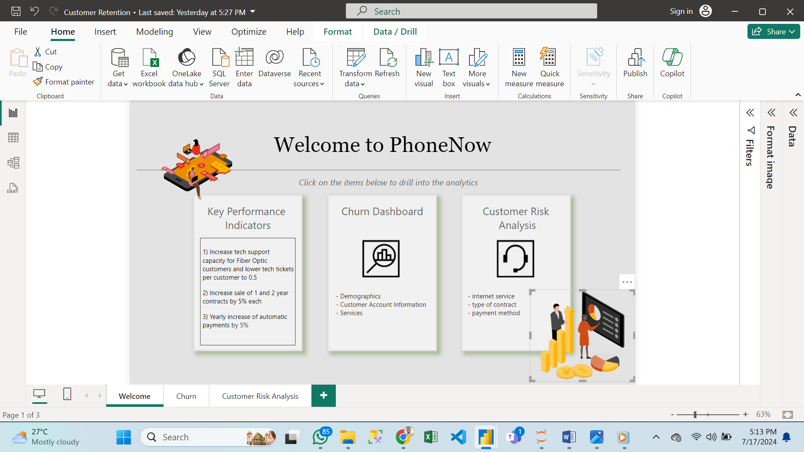

# Call Center Analysis 

## Introduction: 
The project is on a call center data analysis. The project is on the use of Microsoft PowerBI to analyze and visualize reports for Data-Driven Decisions. 

**_Disclaimer_:** _All the datasets used for this project are from a virtual Internship program from PWC carried out by forage. The program is aimed to show Aspiring Data Analysts what and how it looks like to work as a Data Analyst._

## Problem Statement:
This project tends to uncover trends in the company Dataset, to help the management take data-driven decisions, the problem this project tends to answer is 
1.	Total Number of calls answered/Abandoned 
2.	Speed of answer 
3.	Length of calls 
4.	Overall customer satisfaction.

## Skills Demonstrated:
The skills demonstrated in this project include the excellent use of powerBI to perform 
1.	Data Cleaning 
2.	creation of KPIs and Visualization.

## Data Sourcing:
The data for the project was provided by PWC through forage for the virtual internship programme.

## Analysis:

